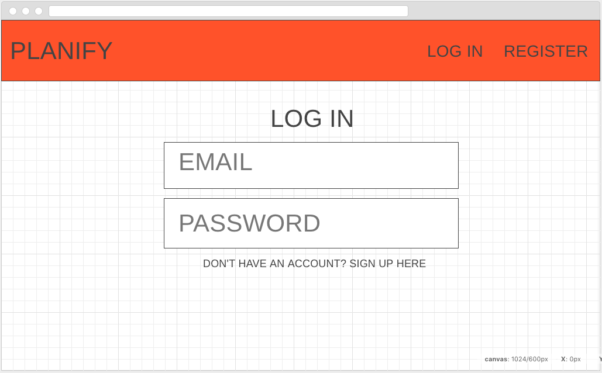
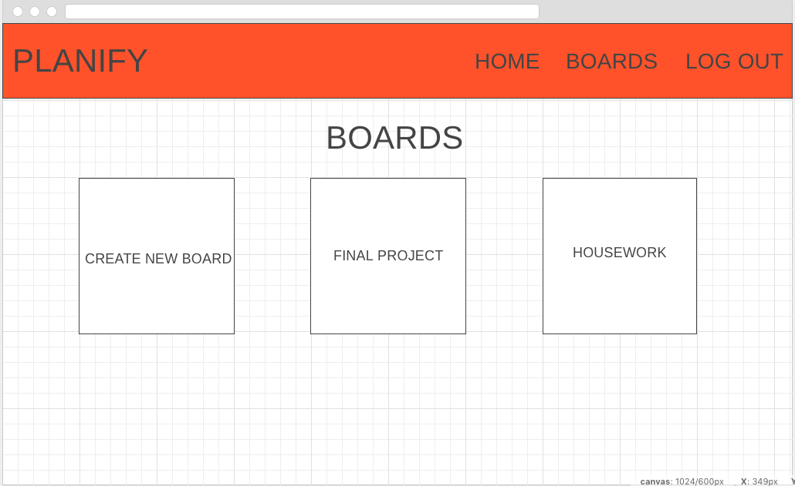
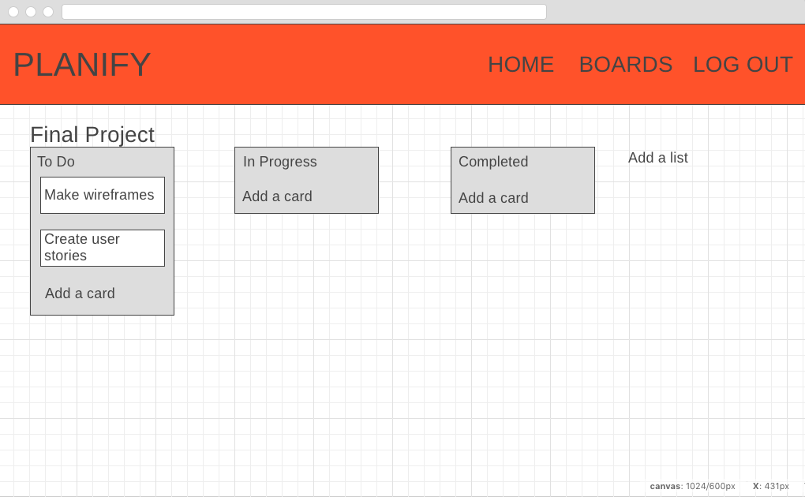

# Planify
Description: This project is basically a clone of Trello. Users will be able to create boards and in the boards, they can create lists filled with cards of tasks they have to do. This is a mix between a project management tool and an advanced to do list. 

## Wireframes

## User Stories
- User can log in and register
- User can create a new board with topic of choice
- User can create lists within the board
- User can create cards within the list
- User can mark card as complete or in progress
- Users can edit and delete a card/list/board
- Users can see motivational quotes in their board, generated from an API
- Post MVP - users can drag cards to other lists 
- Post MVP - users can add comments to cards
- Post MVP - users can add other users to teams/cards

## Priority Matrix
- create database of cards, lists, boards - 5 hr
- Express models, controllers, routes
- user auth - 10 hr
- fetch quotes API - 1 hr
- React - board, lists, cards components - 10 hr

## MVP
- user auth
- React components
- database
- quotes API
- Express models, controllers, routes

## Post MVP
- dragging cards to different lists
- user can add other users to teams 
- user can make comments on cards 
